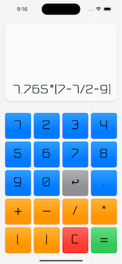
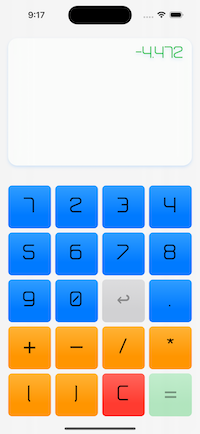
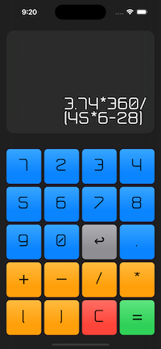
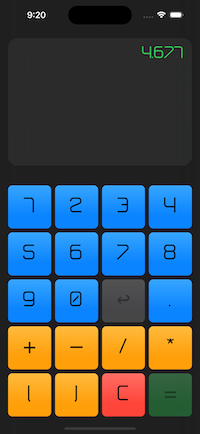

# Custom Calculator (SwiftUI)

- Welcome to the Custom Calculator App! 
- This app is a simple calculator that allows users to perform basic arithmetic calculations. 
- It is built using the SwiftUI 4.0 framework.

 
 

## Features

 - Basic arithmetic operations (addition, subtraction, multiplication, division)
 - Clear and undo buttons
 - Responsive and user-friendly interface
 
 ## How to use

 - Related to: 
    - Part One: [**Video tutorial for beginners**](https://youtu.be/flLk_jt1yWI)
    - Part Two: [**Video tutorial for beginners**](https://youtu.be/0dOIDeyXLM4)
 - Input numbers and select the desired operation using the buttons on the calculator
 - Press the "=" button to see the result
 - Use the "C" button to clear the current calculation, or the "undo" button to undo the last operation.

## Requirements

 - iOS 16 or later
 - Xcode 14 or later
 - Swift 5.7 or later
 - Contribution
 
 ## License
 
 - This app is 100% free and released under the MIT License. You are free to use, modify, and distribute the code as you see fit.

## Credits

- Custom Calculator is a project of [@DimNovo](https://github.com/DimNovo).
- If you find any bugs or have suggestions for improvements, please feel free to open an issue or submit a pull request. 
- Your contributions are always welcome!

